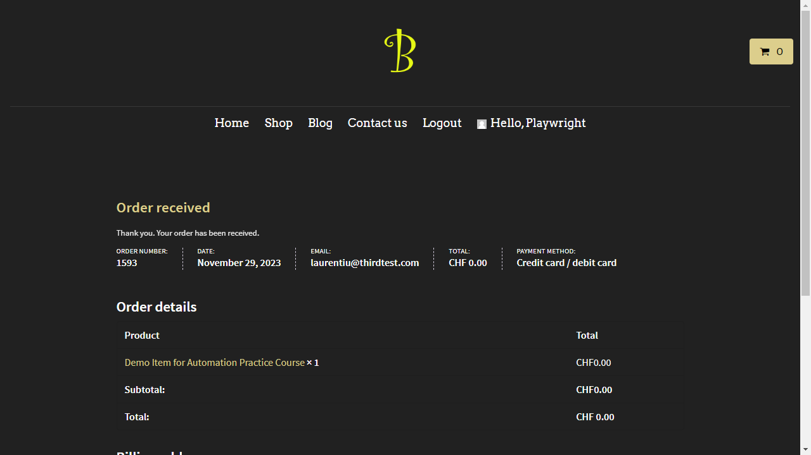

# ai-visual-tester


ai-visual-tester is an innovative npm package that leverages artificial intelligence to perform visual testing on screenshots of applications. By utilizing OpenAI's powerful models, this package can analyze screenshots for visual inconsistencies, UX issues, typos, and other elements critical to high-quality software development.

## Features
- AI-Powered Analysis: Uses OpenAI's GPT models to analyze application screenshots.
- Easy to Use: Simple interface for passing screenshots and receiving AI analysis.
- Flexible: Can be integrated into various stages of the development and testing process.

## Installation
To use ai-visual-tester, first ensure you have Node.js installed. Then, run the following command in your project directory:

```
npm install ai-visual-tester
```
You also need an OpenAI API key stored as an environment variable with this key: OPENAI_KEY.

## Usage
Import the testPhoto function from the package and use it to send a file for analysis. The function expects a file as an argument.

### Example
```
const { testPhoto } = require('ai-visual-tester');

testPhoto('path_to_your_screenshot.jpg')
  .then(lines => {
    console.log("AI Analysis:");
    lines.forEach(line => console.log(line));
  })
  .catch(error => console.error("Error:", error));
```

Using the following file:



The output is the following:

```
1. Color Contrast and Legibility: The contrast between the text and the background seems to be adequate, ensuring legibility. However, the golden logo at the top may be difficult to see for users with visual impairments due to its thin lines and the dark background.

2. Typography and Hierarchy: The use of typography to denote different levels of information hierarchy (like headings for "Order received", "Order details", etc.) appears clear, aiding in user navigation through the content.

3. Alignment and Layout: There is a noticeable issue with alignment; the text in the main body ("Order details", "Product", "Subtotal", etc.) is not aligned with the header ("Home", "Shop", "Blog", etc.), which can create a disorganized appearance.

4. Consistency: The header options ("Home", "Shop", "Blog", "Contact us") and the user greeting ("Hello, Playwright") are inconsistent in their alignment and positioning, which may confuse users regarding the layout's structure.

5. Spacing and Padding: The elements seem to be evenly spaced, but the top menu items could benefit from more padding to balance them within the navigation bar.

6. Call to Action and User Guidance: There appears to be no clear call to action following the order confirmation. Users may be unsure of what to do next after their order has been received.

7. Information Clarity: The order summary is very clear, with the order number, date, email, total, and payment method neatly presented. However, the repetition of the total amount (Subtotal, Total, and a final Total) could be confusing. It may not be clear why there are three separate lines with the same amount (CHF 0.00).

8. Typos and Language: No typos are evident in the text provided. However, it's important to note that without context, it's not possible to check the accuracy of the email address or other user-specific information.
```

## API Reference
### testPhoto(file)
- file (File): The screenshot file to be analyzed.

## Contributing
Contributions are welcome! If you'd like to contribute, feel free to fork the repository and submit a pull request.

## License
This project is licensed under the MIT License - see the LICENSE file for details.

## Acknowledgments
This package utilizes OpenAI's API for AI-powered analysis.
Thanks to all the contributors who have helped improve ai-visual-tester.
